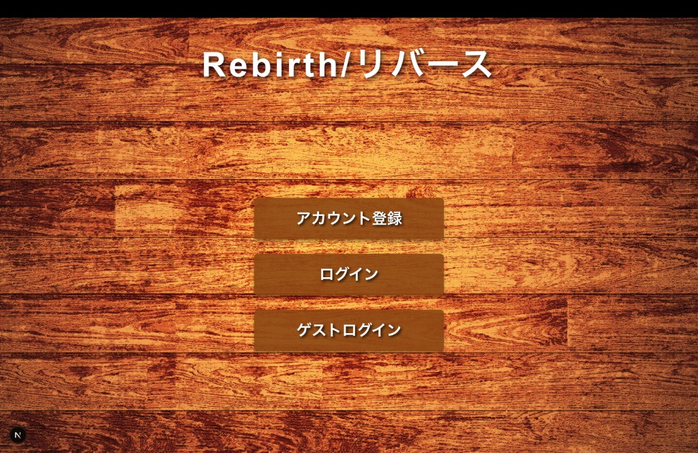
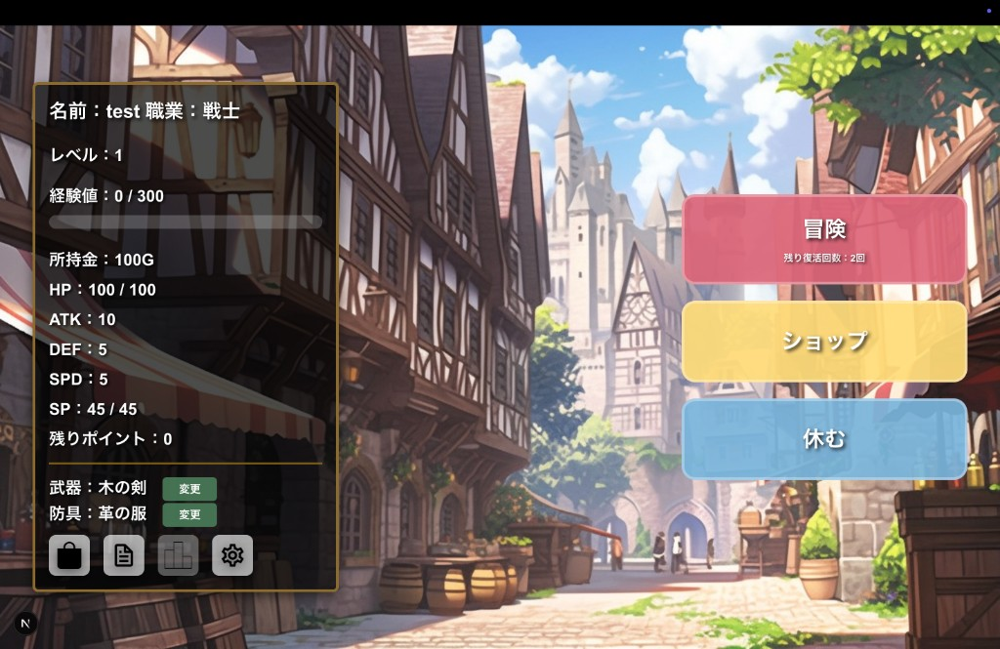
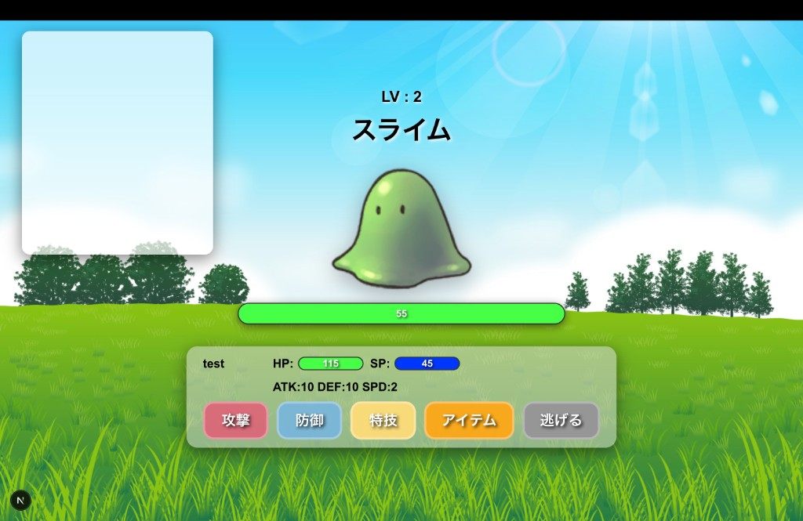

# Rebirth / リバース

> Django + Next.js で構築する、スコア競争型ブラウザ RPG（制作中）

[](https://github.com/TKtkGg)
[](https://nextjs.org/)
[](https://www.djangoproject.com/)
[](https://www.typescriptlang.org/)

---

## 概要

**Rebirth / リバース** は、戦闘を繰り返し最終スコアで競い合う Web RPG です。  
クエスト・ショップ・装備・ランキングなど、RPG としての遊び心地と、スコアアタックとしての再挑戦性を両立させることを目指しています。

| 項目 | 内容 |
|------|------|
| ジャンル | ターン制バトル × スコア競争型 RPG |
| 開発者 | [Yuki Miyamoto (TKtkGg)](https://github.com/TKtkGg) |
| リポジトリ | https://github.com/TKtkGg/mysite |
| ステータス | **制作中**（フロントエンド Next.js 移行フェーズ） |

---

## 制作背景

習得したばかりの Python（Django）を使い、「学習用の小さなアプリ」ではなく、**実際に遊べる規模の Web ゲーム**を一から作りたいと考え、このプロジェクトを開始しました。

当初は HTML / CSS / JavaScript のみでフロントエンドを実装しましたが、画面数と機能が増えるにつれてコードの見通しが悪化し、保守性の限界を感じました。そのため、**既存の Django バックエンドを活かしたまま、Next.js + TypeScript へフロントエンドを段階的に作り直す**方針に切り替え、現在も開発を継続しています。

---

## スクリーンショット

### ログイン画面

アカウント登録・ログイン・ゲストログインの 3 つの導線を用意しています。



### ホーム画面

プレイヤーステータス・装備・所持金・復活回数を確認し、冒険・ショップ・休息へ遷移できます。



### バトル画面

ターン制バトル UI。HP / SP ゲージ、敵情報、コマンド選択（攻撃・防御・特技・アイテム・逃走）を実装済みです。



---

## 開発状況

### 実装済み

- **認証**: アカウント登録 / ログイン / ゲストログイン
- **ホーム画面**: ステータス表示、装備変更、各機能への導線
- **バトル画面（一部）**: ターン制コマンド UI、HP / SP ゲージ、メッセージログ
- **各種機能画面**: ステージ選択、ショップ、インベントリ、装備変更、クエスト、ランキング など
- **バックエンド API**: 上記画面を支える REST エンドポイント群

> 現在の Next.js 実装は `phase4-front-move` ブランチで進行中です。  
> 旧 HTML / CSS / JS 版は `master` ブランチに残しています。

### 開発中

- アクション特技の実装
- バトル中のアニメーション処理（攻撃・被ダメージ・エフェクト）

### 今後の実装予定

- ゲームオーバー処理・画面
- 新職業の追加
- ゲームに深みを出す追加機能（バランス調整、コンテンツ拡充 など）

---

## 技術スタック

| レイヤー | 技術 | 備考 |
|----------|------|------|
| Frontend（旧） | HTML, CSS, JavaScript | 初期実装。Django テンプレートと連携 |
| Frontend（現在） | **TypeScript, Next.js 16, React 19** | App Router / CSS Modules |
| Backend | **Python, Django 5.2** | REST API + セッション認証 |
| Database | **SQLite** | 開発環境 |
| その他 | django-cors-headers | フロント・バックエンド分離時の CORS 対応 |

### 技術選定の理由

| 技術 | 選定理由 |
|------|----------|
| HTML / CSS / JS（初期） | 当時、フロントエンドで実用できる言語がこれのみだったため |
| TypeScript / Next.js（移行後） | 旧実装でコードが散在し保守が困難になったこと、型安全性の確保、現代的なフロントエンド構成への移行を目的として採用 |
| Python | Django と併用するため |
| Django | 習得初期段階であり、**ゲーム制作を通じて ORM・マイグレーション・認証など DB 周りの実践知見を積む**ことを目的として選定 |

---

## アーキテクチャと設計方針

### 全体構成

```
Browser (Next.js :3000)
    ↓ fetch + Cookie (Session / CSRF)
Django REST API (:8000)
    ↓ ORM
SQLite
```

フロントエンドとバックエンドを分離し、Django のセッション認証を Cookie ベースで維持しています。  
`django-cors-headers` と CSRF トークンを組み合わせ、localhost 間のクロスオリジン通信を安全に行えるようにしています。

### バックエンド設計

- **ドメインロジックと API の分離**: `game/views/`（旧テンプレート向け）と `game/api_endpoints/`（REST 向け）を分け、Next.js 移行時に API 層を独立して拡張
- **シリアライザーによるレスポンス整形**: `api_serializers.py` でフロントエンドが扱いやすい JSON 形式に統一
- **イベント駆動のバトル API**: バトル結果を「画面更新用の状態 + イベント（勝利・敗北・メッセージ等）」として返却し、フロント側で UI を段階的に更新

主な API エンドポイント:

| パス | 用途 |
|------|------|
| `/api/auth/` | 認証（登録・ログイン・ゲスト） |
| `/api/players/<id>/` | プレイヤー情報 |
| `/api/stages/<id>/` | ステージ一覧 |
| `/api/battle/<id>/` | バトル進行 |
| `/api/shop/<id>/` | ショップ |
| `/api/inventory/<id>/` | インベントリ |
| `/api/quest/<id>/` | クエスト |
| `/api/ranking/<id>/` | ランキング |

### フロントエンド設計

- **App Router**: `app/` 配下でルーティングを管理（例: `/game/battle/battle/[playerId]/[stageId]`）
- **Atomic Design**: `atoms` → `molecules` → `Organisms` → `features` の階層で UI を分割
- **共通 API クライアント**: `lib/apiClient.ts` に GET / POST・CSRF 処理・エラーハンドリングを集約
- **型定義の分離**: 各 feature 配下に `types.ts` を置き、API レスポンスと UI の契約を明示

### 開発分担

| 担当 | 範囲 |
|------|------|
| 本人 | バックエンド全般、フロントエンドの機能実装・API 連携・状態管理 |
| AI（Cursor） | フロントエンドのレイアウト・UI コンポーネントのたたき台 |

---

## 工夫した点

### 1. フロントエンド移行に伴うバックエンドの全面見直し

旧 HTML / CSS / JS 版は Django テンプレートへコンテキストを渡す構成でした。Next.js 移行にあたり、**データの渡し方そのものが変わる**ため、以下を実施しました。

- テンプレート描画用の View から、JSON を返す REST API への切り替え
- バトル・ショップ・クエスト等、各機能ごとに `api_endpoints/` を新設
- CORS / CSRF / セッション Cookie の設定追加

「フロントを差し替えるだけ」ではなく、**API として再利用可能な形にバックエンドを再設計**した点が、この移行の核心です。

### 2. 段階的なブランチ戦略

機能追加を一度に行わず、フェーズごとにブランチを分けて開発しています。

| ブランチ | 内容 |
|----------|------|
| `phase1-backend` | バックエンド基盤 |
| `phase2-API` | REST API 化 |
| `phase3-frontend` | Next.js フロント初期構築 |
| `phase4-front-move` | 旧画面の Next.js への移行（**現在**） |

旧実装を残しつつ新実装を並行できる構成にすることで、**機能の退行を防ぎながら移行**しています。

### 3. ゲームロジックのモデル設計

`Player`・`Enemy`・`Equipment`・`Item`・`Stage`・`QuestTemplate` など、RPG として必要なドメインを Django モデルとして定義。  
スコア計算用の撃破数・強敵撃破数、ゲストプレイ対応（`is_guest`）、装備スコアなど、**プレイデータと競争要素を DB レベルで管理**しています。

---

## 現在の課題

- Next.js 上で、旧版と同等の「自然な」バトルアニメーションをどう再現するか
- CSS アニメーション / React state / イベント駆動の組み合わせ方の設計
- 移行完了後の E2E 的な動作確認（画面遷移・エッジケース・ゲーム進行の整合性）

---

## ロードマップ

1. **バトル画面の完成** — レイアウト調整、アクション特技、アニメーション
2. **ゲームオーバー画面** — 処理ロジックと UI の実装
3. **総合テスト** — エラー処理、画面遷移、ゲーム進行の自然さの確認
4. **コンテンツ拡充** — 新職業、追加機能、バランス調整

---

## ディレクトリ構成

```
mysite/
├── backend/                    # Django バックエンド
│   ├── config/                 # プロジェクト設定（settings, urls, CORS）
│   ├── accounts/               # 認証・ユーザー管理
│   │   ├── api_views.py        # 認証 API
│   │   └── models.py
│   ├── game/                   # ゲーム本体
│   │   ├── models.py           # Player, Enemy, Equipment, Stage 等
│   │   ├── api_endpoints/      # REST API（battle, shop, quest 等）
│   │   ├── api_serializers.py  # JSON レスポンス整形
│   │   ├── views/              # 旧テンプレート向け View
│   │   ├── templates/          # 旧 HTML テンプレート
│   │   └── migrations/
│   └── manage.py
│
├── frontend/                   # Next.js フロントエンド
│   ├── src/
│   │   ├── app/                # App Router（ページ定義）
│   │   │   ├── auth/           # ログイン・登録
│   │   │   └── game/           # ゲーム画面群
│   │   ├── features/           # 画面単位のロジック・UI
│   │   │   ├── auth/
│   │   │   ├── battle_home/
│   │   │   ├── battle_battle/
│   │   │   ├── shop/
│   │   │   ├── quest/
│   │   │   └── ...
│   │   ├── components/         # 共通 UI（Atomic Design）
│   │   │   ├── atoms/
│   │   │   ├── molecules/
│   │   │   └── Organisms/
│   │   └── lib/
│   │       └── apiClient.ts    # API 通信クライアント
│   └── public/game/img/        # ゲーム画像アセット
│
├── docs/
│   └── screenshots/            # README 用スクリーンショット
├── requirements.txt
└── README.md
```

---

## セットアップ（開発環境）

### 前提

- Python 3.x
- Node.js 20+
- npm

### バックエンド

```bash
cd backend
pip install django django-cors-headers
python manage.py migrate
python manage.py runserver
# → http://localhost:8000
```

### フロントエンド

```bash
cd frontend
npm install
# .env.local に NEXT_PUBLIC_API_BASE_URL=http://localhost:8000 を設定
npm run dev
# → http://localhost:3000
```

---

## 作者

**Yuki Miyamoto** — [GitHub @TKtkGg](https://github.com/TKtkGg)

- Portfolio: [portfolio-flame-chi-96.vercel.app](https://portfolio-flame-chi-96.vercel.app)
- Email: miyamotoyuki0729@gmail.com

---

## ライセンス

制作中の個人プロジェクトです。ライセンスは未定です。
